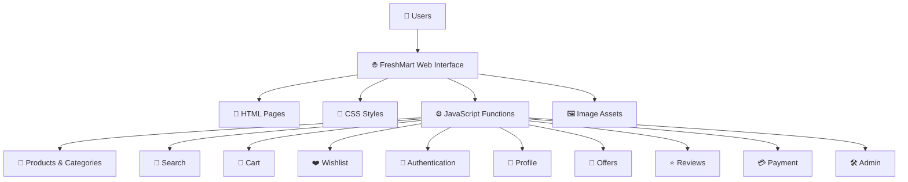
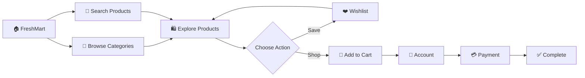
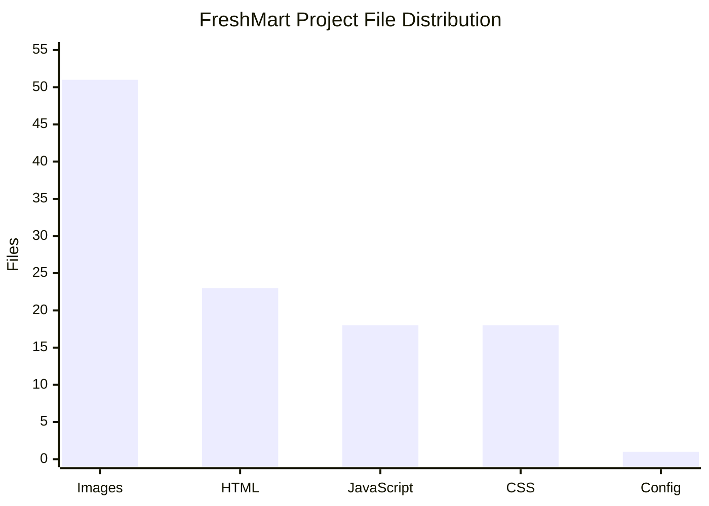
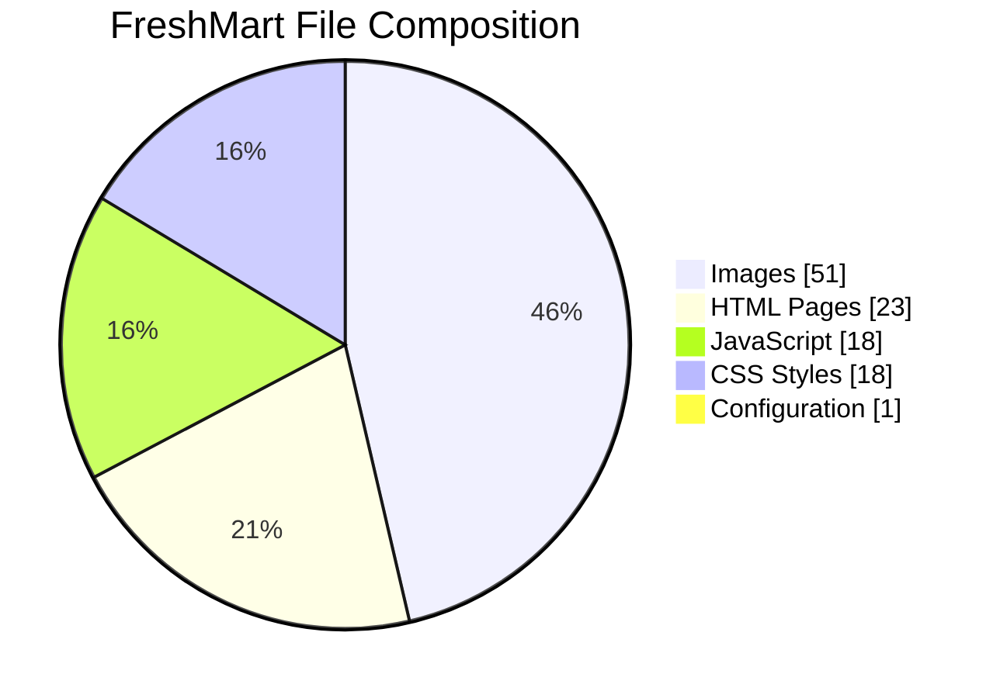
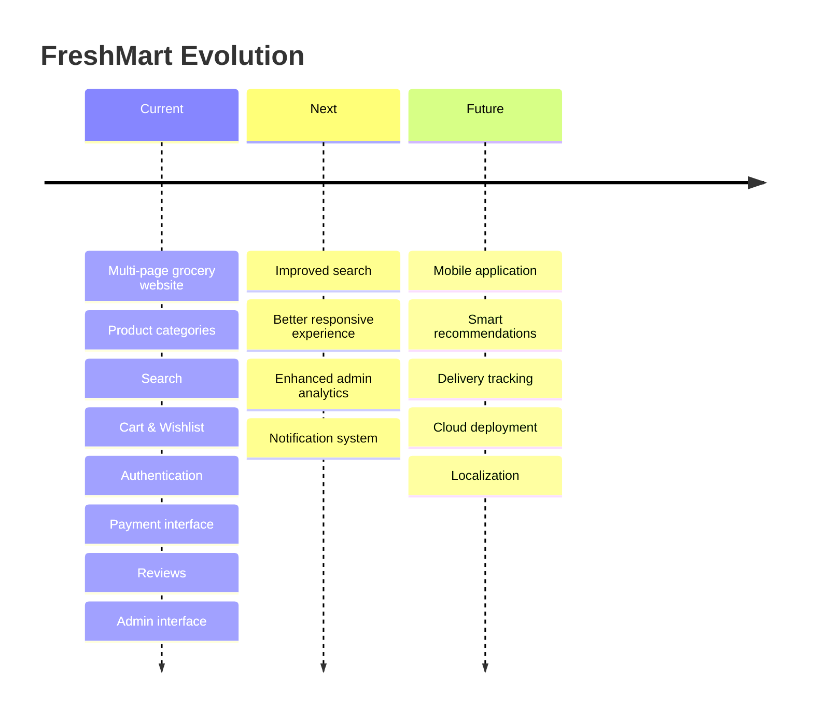

<!-- ====================================================== -->
<!--               FRESHMART WEBSITE README                 -->
<!--                    M.R.Ahamed                           -->
<!-- ====================================================== -->

<div align="center">


<br/>

# 🛒🌿 FRESHMART WEBSITE 🌿🛒

### Fresh Groceries • Modern Interface • Smarter Shopping

<p>
A modern and responsive grocery e-commerce web application built with
<strong>HTML5, CSS3 and JavaScript</strong>.
</p>

<br/>


<br/><br/>


<br/><br/>

<a href="#-about-freshmart">About</a>
&nbsp; • &nbsp;
<a href="#-features">Features</a>
&nbsp; • &nbsp;
<a href="#%EF%B8%8F-system-architecture">Architecture</a>
&nbsp; • &nbsp;
<a href="#-application-workflow">Workflow</a>
&nbsp; • &nbsp;
<a href="#-project-structure">Structure</a>
&nbsp; • &nbsp;
<a href="#-project-analytics">Analytics</a>
&nbsp; • &nbsp;
<a href="#-getting-started">Setup</a>
&nbsp; • &nbsp;
<a href="#-future-development">Future</a>

</div>

---

# 🌿 About FreshMart

**FreshMart** is a multi-page grocery e-commerce web application designed to
provide a clean and organized digital shopping experience.

The application combines dedicated HTML pages, responsive CSS styling,
JavaScript-powered functionality and grocery-related visual assets.

Users can explore grocery categories, search products, access a store,
manage a cart and wishlist, view offers and reviews, use account-related
pages and progress through a payment interface.

The project also contains dedicated administrative functionality.

> ### 🛒 One website. Multiple grocery categories. A complete shopping-oriented experience.

---

## 🎯 Project Vision

```text
                         🌿 FRESHMART 🌿
                              │
              ┌───────────────┼───────────────┐
              │               │               │
              ▼               ▼               ▼
        🛍️ DISCOVER       🛒 SHOP         👤 MANAGE
              │               │               │
              ▼               ▼               ▼
        Categories         Cart            Account
        Search             Wishlist        Profile
        Products           Payment         Reviews
        Offers                             Admin
```

---

# 🖼️ Project Showcase

> Place the generated cover image at:
>
> `Images/README/freshmart-cover.png`

<div align="center">


### 🛒🌿✨ FreshMart — Modern Grocery Shopping Experience

**A Fresh, Responsive & Feature-Rich E-Commerce Web Application**

</div>

---

# ✨ Features

<div align="center">

> Place the generated features image at:
>
> `Images/README/freshmart-features-showcase.png`


### ✨🛍️❤️🚀 Everything FreshMart Offers

</div>

<br/>

| Feature | Function |
|---|---|
| 🏠 **Homepage** | Main FreshMart shopping interface |
| 🛍️ **Store** | Grocery shopping and product browsing |
| 🥕 **Categories** | Dedicated grocery category pages |
| 🔎 **Search** | Product discovery through search results |
| 🛒 **Cart** | Shopping-cart functionality |
| ❤️ **Wishlist** | Save preferred products |
| 👤 **Authentication** | Account authentication interface |
| 🪪 **Profile** | User profile functionality |
| 🎁 **Offers** | Promotional content and offers |
| ⭐ **Reviews** | Customer review interface |
| 💳 **Payment** | Payment-related interface |
| ℹ️ **Information** | Supporting information pages |
| 📞 **Contact** | Customer contact interface |
| 🌿 **About Us** | FreshMart information and story |
| 🛠️ **Admin** | Administrative interface and functionality |

---

# 🥬 Grocery Departments

<div align="center">

| 🍎 Fruits | 🥦 Vegetables | 🥩 Meat | 🥛 Dairy |
|:---:|:---:|:---:|:---:|
| Fresh fruits | Fresh vegetables | Meat products | Dairy products |

| 🥖 Bakery | 🥤 Beverages | 🍿 Snacks | 🍚 Pantry |
|:---:|:---:|:---:|:---:|
| Bakery items | Drinks | Snacks | Pantry staples |

</div>

---

# 🏗️ System Architecture

<div align="center">

> Place the generated architecture image at:
>
> `Images/README/freshmart-system-architecture.png`


### 🏗️⚙️🔗💻 Inside FreshMart

**A visual overview of how the project components work together**

</div>



---

# 🔄 Application Workflow

<div align="center">

> Place the generated workflow image at:
>
> `Images/README/freshmart-application-workflow.png`


### 🔄🛒💳📦 From Browse to Shopping Flow

</div>



---

# 📂 Project Structure

<div align="center">

> Place the generated project-architecture image at:
>
> `Images/README/freshmart-project-architecture.png`


### 📁🗂️💻⚙️ Files, Folders & Code Organization

</div>

```text
FreshMart-Website/
│
├── 📂 Functions/
│   ├── ProductCategoryList.js/
│   │   └── category.js
│   ├── about-us.js
│   ├── admin.js
│   ├── auth.js
│   ├── cart.js
│   ├── category.js
│   ├── contact-us.js
│   ├── info.js
│   ├── main.js
│   ├── offers.js
│   ├── payment.js
│   ├── product.js
│   ├── products.js
│   ├── profile.js
│   ├── reviews.js
│   ├── search-results.js
│   ├── store.js
│   └── wishlist.js
│
├── 📂 Images/
│   ├── Apple.jpg
│   ├── Bakery.jpg
│   ├── Banana.jpg
│   ├── Beef.jpg
│   ├── Bread.jpg
│   ├── Broccoli.jpg
│   ├── CVVlocator.jpg
│   ├── Cake.jpg
│   ├── Cheese.jpg
│   ├── Chicken.jpg
│   ├── Chocolate.jpg
│   ├── Cookies.jpg
│   ├── Croissants.jpg
│   ├── Fish.jpg
│   ├── Flour.jpg
│   ├── HeroImage.jpg
│   ├── HeroImage01.jpg
│   ├── Juice.jpg
│   ├── Mango.jpg
│   ├── Milk.jpg
│   ├── OffersBanner.jpg
│   ├── OurStory.jpg
│   ├── PantryStaples.jpg
│   ├── Popcorn.jpg
│   ├── Potato.jpg
│   ├── ReviewAvatar.jpg
│   ├── Rice.jpg
│   ├── Snacks.jpg
│   ├── Soda.jpg
│   ├── SoftDrink.jpg
│   ├── Sugar.jpg
│   ├── Tomato.jpg
│   ├── Yogurt.jpg
│   └── ...
│
├── 📂 Pages/
│   ├── Bakery.html
│   ├── Beverages.html
│   ├── Diary.html
│   ├── Fruits.html
│   ├── Meat.html
│   ├── PantryStaples.html
│   ├── Snacks.html
│   ├── Vegetables.html
│   ├── about-us.html
│   ├── admin.html
│   ├── auth.html
│   ├── cart.html
│   ├── category.html
│   ├── contact-us.html
│   ├── index.html
│   ├── info.html
│   ├── offers.html
│   ├── payment.html
│   ├── profile.html
│   ├── reviews.html
│   ├── search-results.html
│   ├── store.html
│   └── wishlist.html
│
├── 📂 Styles/
│   ├── ProductCategoryList.css/
│   │   └── category.css
│   ├── about-us.css
│   ├── admin.css
│   ├── auth.css
│   ├── cart.css
│   ├── category.css
│   ├── contact-us.css
│   ├── info.css
│   ├── offers.css
│   ├── payment.css
│   ├── product.css
│   ├── profile.css
│   ├── reviews.css
│   ├── search-results.css
│   ├── store.css
│   ├── style.css
│   └── wishlist.css
│
├── 📄 .gitignore
└── 📄 README.md
```

---

# 💻 Technology Stack

<div align="center">


<br/><br/>

| Technology | Usage |
|:---:|---|
| 🟧 **HTML5** | Application pages and semantic structure |
| 🟦 **CSS3** | Styling, layouts and responsive presentation |
| 🟨 **JavaScript** | Application interactivity and functionality |
| 🟥 **Git** | Source version control |
| ⬛ **GitHub** | Repository hosting and project presentation |
| 🔵 **VS Code** | Development environment |

</div>

---

# 📊 Project Analytics

The following statistics describe the files committed in the initial
FreshMart project version.

## 📈 File Distribution — Bar Chart



### Repository Composition

```text
Images       ███████████████████████████████████████████████████  51
HTML         ███████████████████████                              23
JavaScript   ██████████████████                                   18
CSS          ██████████████████                                   18
Config       █                                                     1
```

<div align="center">

| Type | Files | Share |
|:---|---:|---:|
| 🖼️ Images | 51 | 45.95% |
| 📄 HTML | 23 | 20.72% |
| ⚙️ JavaScript | 18 | 16.22% |
| 🎨 CSS | 18 | 16.22% |
| 🔧 Config | 1 | 0.90% |
| **Total** | **111** | **100%** |

</div>

---

## 🥧 Project Composition — Pie Visualization



---

# 📌 Project Numbers

<div align="center">


</div>

---

# 🧩 Explore FreshMart

<details>
<summary><b>🏠 Main Shopping Experience</b></summary>

<br/>

- Homepage
- Store
- Categories
- Search Results
- Product functionality
- Offers
- Cart
- Wishlist
- Payment

</details>

<details>
<summary><b>🥕 Grocery Categories</b></summary>

<br/>

- Fruits
- Vegetables
- Meat
- Dairy
- Bakery
- Beverages
- Snacks
- Pantry Staples

</details>

<details>
<summary><b>👤 Customer Experience</b></summary>

<br/>

- Authentication
- Profile
- Reviews
- Contact Us
- Information
- About Us

</details>

<details>
<summary><b>🛠️ Administration</b></summary>

<br/>

FreshMart contains:

- `Pages/admin.html`
- `Styles/admin.css`
- `Functions/admin.js`

These files provide the project's administrative interface and associated
front-end functionality.

</details>

<details>
<summary><b>🖼️ Visual Assets</b></summary>

<br/>

The project includes grocery imagery, category imagery, hero banners,
offer graphics, review avatars, team images and supporting interface assets.

</details>

---

# 🎮 FreshMart Mini Quest

<div align="center">

### 🕹️ Can You Complete the FreshMart Journey?

</div>

```text
╔══════════════════════════════════════════════════════╗
║                 🌿 FRESHMART QUEST 🌿               ║
╠══════════════════════════════════════════════════════╣
║                                                      ║
║  🏠 START                                            ║
║     │                                                ║
║     ▼                                                ║
║  🥦 Explore Categories                +100 XP        ║
║     │                                                ║
║     ▼                                                ║
║  🔎 Discover Products                 +150 XP        ║
║     │                                                ║
║     ├──────────────► ❤️ Wishlist       +200 XP       ║
║     │                                                ║
║     ▼                                                ║
║  🛒 Build Your Cart                   +300 XP        ║
║     │                                                ║
║     ▼                                                ║
║  👤 Access Your Account               +400 XP        ║
║     │                                                ║
║     ▼                                                ║
║  💳 Reach Payment                     +500 XP        ║
║     │                                                ║
║     ▼                                                ║
║  🏆 FRESHMART SHOPPING CHAMPION                      ║
║                                                      ║
╚══════════════════════════════════════════════════════╝
```

---

# 🚀 Getting Started

## 1. Clone FreshMart

```bash
git clone https://github.com/Ahamed369/FreshMart-Website.git
```

## 2. Enter the Project

```bash
cd FreshMart-Website
```

## 3. Open in VS Code

```bash
code .
```

## 4. Launch the Homepage

The main application page is:

```text
Pages/index.html
```

Open that file in your browser.

You can also use a local static development server such as **Live Server**
for a smoother development workflow.

---

# 🧭 User Journey

```text
                         🏠 HOME
                            │
             ┌──────────────┼──────────────┐
             │              │              │
             ▼              ▼              ▼
        🥦 CATEGORIES   🔎 SEARCH      🎁 OFFERS
             │              │              │
             └──────────────┼──────────────┘
                            ▼
                       🛍️ PRODUCTS
                            │
                    ┌───────┴───────┐
                    │               │
                    ▼               ▼
                ❤️ WISHLIST      🛒 CART
                                    │
                                    ▼
                                👤 ACCOUNT
                                    │
                                    ▼
                                💳 PAYMENT
```

---

# 🌟 Why FreshMart?

| 🌿 | Project Strength |
|---|---|
| 🛒 | Grocery-focused e-commerce interface |
| 🧩 | Multiple interconnected application pages |
| ⚙️ | Dedicated JavaScript functionality |
| 🎨 | Separate styling architecture |
| 🖼️ | Rich grocery and interface image library |
| ❤️ | Wishlist functionality |
| 🔎 | Search-results functionality |
| 👤 | Authentication and profile interfaces |
| ⭐ | Reviews interface |
| 🎁 | Offers section |
| 💳 | Payment interface |
| 🛠️ | Administrative interface |
| 📂 | Organized project directory structure |

---

# 🔮 Future Development

<div align="center">

> Place the generated future-showcase image at:
>
> `Images/README/freshmart-future-showcase.png`


### 🚀🔮💡🌍 The Next Evolution of FreshMart

</div>

Potential future extensions include:

- 📱 Dedicated mobile application
- 🤖 Personalized product recommendations
- 🔔 Real-time notifications
- 🔎 Advanced search and filtering
- 📊 Expanded admin analytics
- 📦 Advanced order management
- 💳 Additional payment integrations
- 🚚 Delivery tracking
- 🌍 Localization and multilingual support
- ☁️ Cloud deployment
- 🛍️ Multi-vendor capabilities
- 🔐 Expanded security controls

> **Note:** These are future-development concepts and are not presented as
> features already implemented in the current repository.

---

# 🗺️ Development Roadmap



---

# 🏆 Project Highlights

<div align="center">


</div>

---

# 🤝 Contributing

Contributions and suggestions are welcome.

```bash
# Fork the repository

# Create a branch
git checkout -b feature/your-improvement

# Stage your work
git add .

# Commit
git commit -m "Add new improvement"

# Push
git push origin feature/your-improvement
```

Then open a Pull Request.

---

# ⭐ Support FreshMart

If you like the project, you can:

- ⭐ Star the repository
- 🍴 Fork it
- 💡 Suggest improvements
- 🐛 Report issues
- 🤝 Contribute

<div align="center">

<a href="https://github.com/Ahamed369/FreshMart-Website">
  
</a>

</div>

---

# 👨‍💻 Developer

<div align="center">

## M.R.Ahamed

### Computer Science Undergraduate • Full-Stack & Mobile App Developer • Entrepreneur

<br/>

<a href="https://github.com/Ahamed369">

</a>

<a href="https://www.linkedin.com/in/mr-ahamed-6146a5276/">

</a>

<br/><br/>

**Designed & Developed by M.R.Ahamed**

</div>

---

# 📬 Repository

<div align="center">

<a href="https://github.com/Ahamed369/FreshMart-Website">

</a>

<br/><br/>

**Ahamed369 / FreshMart-Website**

</div>

---

<div align="center">


### 🌿 Fresh Groceries • 🛒 Modern Shopping • 💻 Digital Experience

**© 2026 M.R.Ahamed • FreshMart Website**

### ⭐ Thank You for Visiting FreshMart ⭐

</div>
